<div align="center">

<!--  ANIMATED HEADER BANNER -->


<br/>

<!-- ANIMATED TYPING INTRO -->
<a href="https://git.io/typing-svg">
  
</a>

<br/><br/>

<!-- SOCIAL BADGES -->
<a href="mailto:lavishdadhich20@gmail.com">
  
</a>
&nbsp;
<a href="https://linkedin.com/in/lavish-dadhich" target="_blank">
  
</a>
&nbsp;
<a href="https://github.com/Lavish-Dadhich20">
  
</a>
&nbsp;


</div>

---

## `> whoami`

```yaml
Name      : Lavish Dadhich
Role      : Full-Stack Developer & Agentic AI Builder
Location  : Udaipur, Rajasthan, India
Education : B.Tech CSE @ GITS (RTU) | CGPA: 8.7/10 | 2024–2028
Status    : 🟢 Open to Internships & Collaborations
Passion   : Building systems that think, adapt, and scale
```

> 🚀 First-year undergrad who shipped a **production-grade AI loan system** before most students finish their first semester.
> Building at the intersection of **intelligent automation**, **full-stack engineering**, and **real-world ML pipelines**.

---

## `> skills --list`

<table>
<tr>
<td width="50%" valign="top">

### 💻 Languages


### 🌐 Web Stack


</td>
<td width="50%" valign="top">

### 🧠 AI / ML


### 🛠️ DevTools


</td>
</tr>
</table>

---

## `> projects --featured`

<details open>
<summary><b>🤖 SmartLoan AI — Agentic Loan Processing Chatbot</b> &nbsp;<code>2025</code></summary>

<br/>

> An end-to-end AI-powered loan assistant — built from scratch in **Year 1** of university.

**What it does:**
- Automates **eligibility analysis**, real-time **EMI calculations**, and issues **preliminary approval decisions** — zero manual intervention
- Implements sophisticated **multi-turn dialogue** using LLM reasoning to harvest and validate clean user financial data
- Generates **personalised loan structuring** recommendations based on dynamic financial inputs
- Reduces typical loan pre-screening time from hours → seconds

**Tech Stack:**


</details>

---

<details open>
<summary><b>🛡️ AI Fraud Detection System</b> &nbsp;<code>Mar 2026 – Apr 2026</code></summary>

<br/>

> A production-quality ML pipeline for detecting fraudulent transactions in highly imbalanced financial datasets.

**What it does:**
- Architected a **tabular classification pipeline** using state-of-the-art tree ensembles — **Random Forest** + **XGBoost**
- Solved the hard class-imbalance problem using **SMOTE** (Synthetic Minority Over-sampling) to ensure minority-class learning
- Maximised **Precision-Recall** through end-to-end **hyperparameter tuning** and deep **feature engineering**
- Delivers an audit-ready pipeline: preprocessing → training → evaluation → deployment-ready model artifact

**Tech Stack:**


</details>

---

<details>
<summary><b>📊 Store Invoice & Sales Management System</b> &nbsp;<code>2024</code></summary>

<br/>

> A professional full-stack ERP-style platform built to replace spreadsheets in retail operations.

**What it does:**
- Unified platform for **invoice generation**, **inventory management**, and **multi-mode payment tracking** (cash / online / credit)
- Built an **analytical sales dashboard** showing daily, monthly, and annual turnover metrics in real-time
- Modelled a **relational-style schema inside MongoDB** optimised for rapid aggregations and transactional integrity

**Tech Stack:**


</details>

---

## `> achievements --highlight`

<div align="center">

| 🏅 Achievement | 📌 Detail |
|---|---|
| 🚀 **Production AI System in Year 1** | Built & shipped SmartLoan AI chatbot as a 1st-year B.Tech student |
| 🧠 **ML Pipeline End-to-End** | Fraud detection system with SMOTE + XGBoost, fully tuned |
| 🏆 **Hackathon Builder** | Active participant — functional prototypes under time pressure |
| 📊 **CGPA 8.7/10** | Strong academic foundation alongside real-world projects |

</div>

---

## `> certifications --list`

<div align="center">


&nbsp;

&nbsp;


</div>

---

## `> currently --doing`

```python
class LavishDadhich:
    def __init__(self):
        self.name        = "Lavish Dadhich"
        self.degree      = "B.Tech CSE @ GITS Udaipur (2024-2028)"
        self.cgpa        = 8.7
        self.location    = "Udaipur, Rajasthan, India"

    def current_focus(self):
        return [
            "🤖  Building LLM-powered Agentic AI Systems",
            "🌐  Advancing Full-Stack Web Architecture (MERN)",
            "📊  Machine Learning — Classification & Feature Engineering",
            "🧩  Sharpening DSA for Competitive Programming",
            "🚀  Seeking Internship Opportunities",
        ]

    def open_to(self):
        return ["Internships", "Collaborations", "Open Source", "Hackathons"]

    def contact(self):
        return "lavishdadhich20@gmail.com"

me = LavishDadhich()
print(me.current_focus())
```

---

<div align="center">

### 💡 Let's Build Something Extraordinary

<a href="mailto:lavishdadhich20@gmail.com">
  
</a>
&nbsp;
<a href="https://linkedin.com/in/lavish-dadhich">
  
</a>

<br/><br/>

```
╔══════════════════════════════════════════════════════╗
║  "The best way to predict the future is to build it  ║
║       — one line of code at a time."                 ║
╚══════════════════════════════════════════════════════╝
```


</div>
